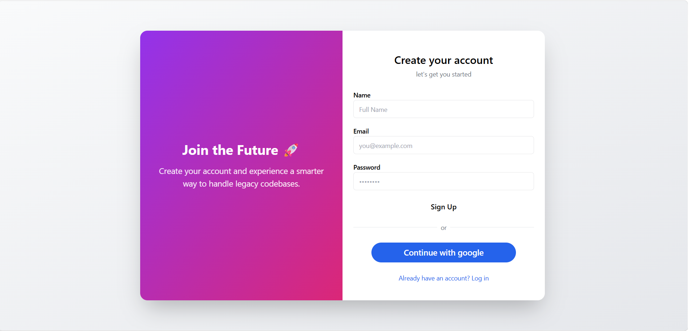
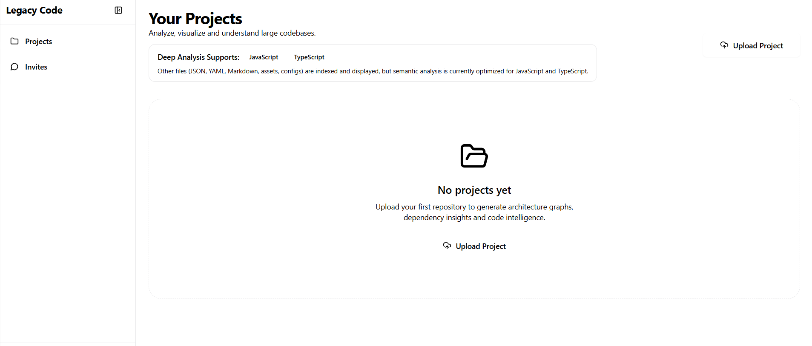
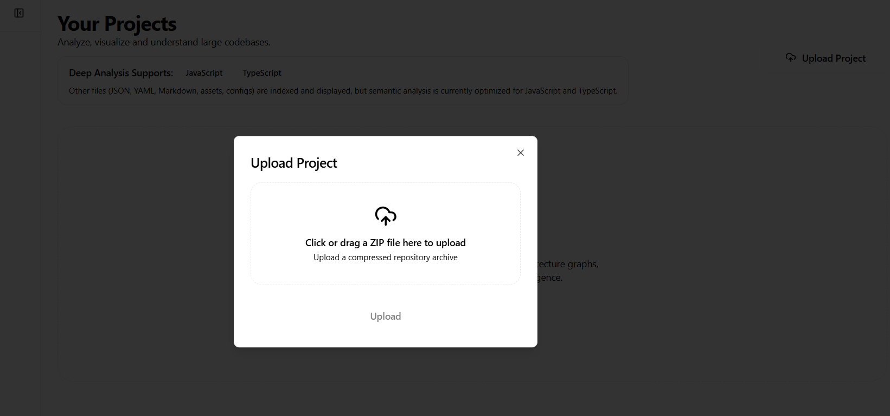
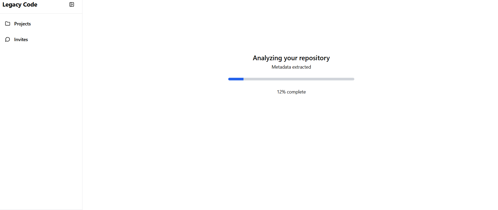
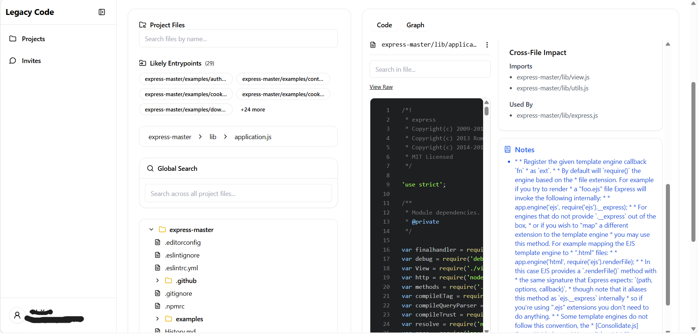
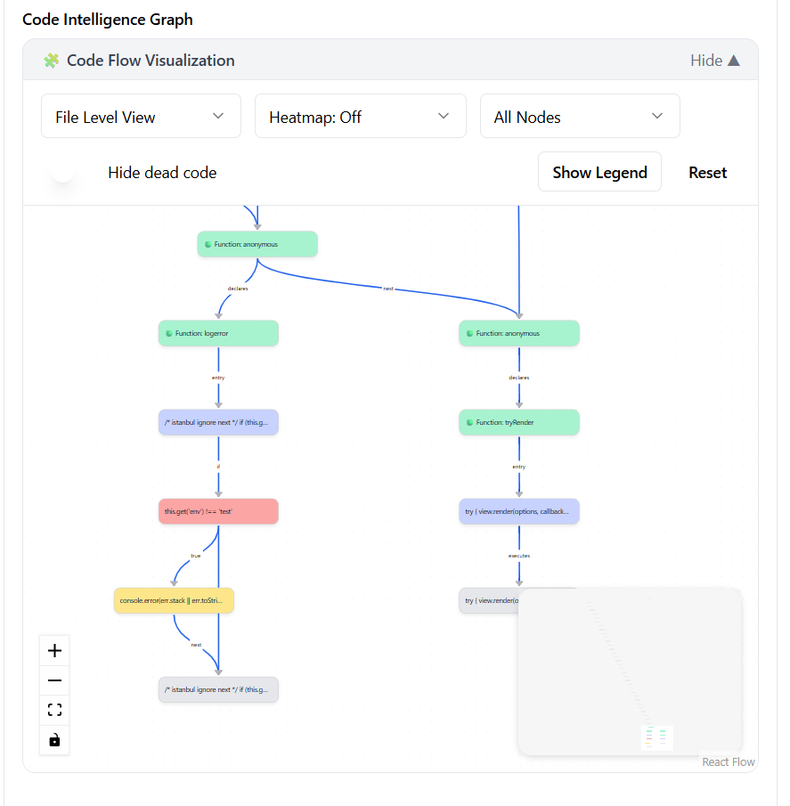

# Legacy Codebase Analyzer

> Understand unfamiliar JavaScript and TypeScript repositories through interactive architecture visualization, dependency analysis, and code exploration.

**Live Demo:** https://legacy-codebase.vercel.app/

## Overview

Understanding an unfamiliar codebase can be challenging, especially when the project contains many files with complex dependencies. Developers often spend significant time navigating folders, tracing imports and trying to understand how different parts of the application are connected.

Legacy Codebase Analyzer was built to simplify this process. It allows users to upload a JavaScript or TypeScript repository as a ZIP archive, analyzes the project in the background, and generates interactive visualizations, dependency information and repository insights to help developers understand the overall architecture more quickly.

The application follows an asynchronous processing architecture using background workers, allowing repository uploads to remain responsive while long-running analysis tasks execute independently.

## Features

### Interactive Code Flow Visualization

- Generate an interactive graph showing relationships between files and modules.
- Explore repository architecture visually.
- Navigate project dependencies with an intuitive graph interface.

### Repository Explorer

- Browse the complete project structure through an IDE-like file explorer.
- View source code with syntax highlighting.
- Inspect project files and extracted metadata.

### Asynchronous Analysis Pipeline

- Upload JavaScript and TypeScript repositories as ZIP archives.
- Background analysis using a job queue and dedicated worker.
- Real-time progress updates throughout the analysis process.

### Repository Insights

- Generate repository metadata and project statistics.
- Visualize relationships between files and modules.
- Explore project structure through generated dependency information.
- Help developers understand the overall project structure.

### Project Management

- Create and manage multiple repository analysis projects.
- Organize repositories within a dedicated dashboard.
- Access project details and analysis workspace from a single interface.

### Authentication

- Secure Email/Password authentication.
- Google Sign-In support.
- Protected routes for authenticated users.

## Screenshots

### Authentication

<p align="center">
  
</p>

Secure authentication using Email/Password and Google Sign-In.

---

### Project Dashboard

<p align="center">
  
</p>

Manage multiple repository analysis projects from a central dashboard.

---

### Repository Upload

<p align="center">
  
</p>

Upload JavaScript or TypeScript repositories as ZIP archives for analysis.

---

### Repository Analysis

<p align="center">
  
</p>

Monitor repository analysis as it progresses through the processing pipeline.

---

### Repository Explorer

<p align="center">
  
</p>

Browse the project structure and inspect source files through an IDE-like interface.

---

### Code Flow Visualization

<p align="center">
  
</p>

Explore relationships between files and modules using an interactive code flow graph.

## Tech Stack

### Frontend

- Next.js
- React
- TypeScript
- Tailwind CSS
- shadcn/ui

### Backend

- Next.js API Routes
- MongoDB

### Authentication

- Firebase Authentication

### Analysis Pipeline

- BullMQ
- Redis
- Babel Parser

### Visualization

- React Flow

## Core Analysis Architecture

```text
User
 │
 ▼
Next.js Frontend
 │
 ▼
Upload Repository
 │
 ▼
Next.js API
 │
 ▼
Create Analysis Job
 │
 ▼
Background Worker
 │
 ▼
Parse & Analyze Repository
 │
 ▼
MongoDB
 │
 ▼
Interactive UI
```

- The application uses an asynchronous analysis pipeline to keep repository uploads responsive. After a repository is uploaded, the backend creates an analysis job, which is processed independently by a background worker. The generated metadata and repository insights are stored in MongoDB and later retrieved by the frontend for interactive exploration.

## Local Setup

### Prerequisites

Before running the project locally, make sure you have:

- Node.js
- MongoDB
- npm

### Installation

```bash
git clone https://github.com/Amateur-Div/Legacy-Codebase.git
cd Legacy-Codebase
npm install
```

> **Note:** Start the Redis server and the analysis worker before uploading repositories.

### Environment Variables

Create a `.env.local` file and configure the required environment variables.

| Variable              | Description                         |
| --------------------- | ----------------------------------- |
| MONGODB_URI           | MongoDB connection string           |
| FIREBASE_CLIENT_EMAIL | Firebase service account email      |
| FIREBASE_PRIVATE_KEY  | Firebase private key                |
| REDIS_URL             | Redis connection URL(upstash/local) |

### Run the Development Server

```bash
npm run dev
```

Open `http://localhost:3000` in your browser.

## Deployment

The application is deployed on Vercel for demonstration purposes.

The complete repository analysis pipeline relies on a dedicated background worker for processing uploaded repositories asynchronously. This worker is not included in the public deployment due to the limitations of the free hosting environment.

The public deployment showcases the application's interface and overall workflow, while the complete repository analysis experience is available when running the project locally

## Future Improvements

- Support additional programming languages beyond JavaScript and TypeScript.
- Resume interrupted repository analysis.
- Incremental analysis to process only changed files.
- Improved scalability for analyzing larger repositories.
- AI-powered code explanations and repository summaries.
- Team collaboration and shared workspaces.

## License

This repository is shared for portfolio and educational purposes only.

The source code is not licensed for reuse, modification, or redistribution. All rights are reserved by the author.
